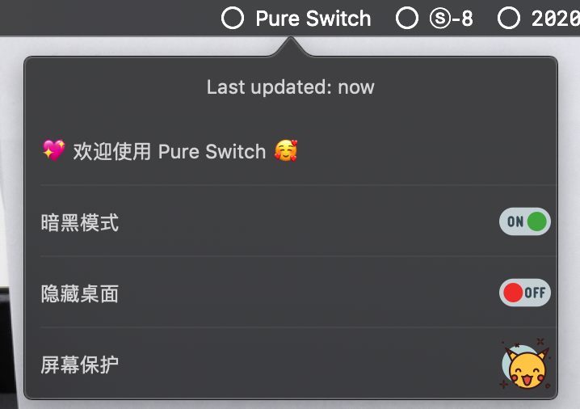

# Pure Switch

> A pure & powerful [Here](https://here.app) plugin for toggle switches in one place.

[中文说明](./README_zh.md)

## Installation

### One Click  (Recommend)

👉 <a href="https://jump.here.app/?installPlugin?title=Pure-Switch&url=https://github.com/FriendsOfHere/one-switch/releases/latest/download/Pure-Switch.hereplugin">Click Here 🔌</a>

### Manually
1. Go [releases](https://github.com/FriendsOfHere/pure-switch/releases/latest/) page
2. Download the latest release & double click the `Pure-Switch.hereplugin`

## Feature
- Dark Mode
- Hide Desktop icons
- Screen Saver

## License
This plugin is published under the [MIT License](./LICENSE.md)
